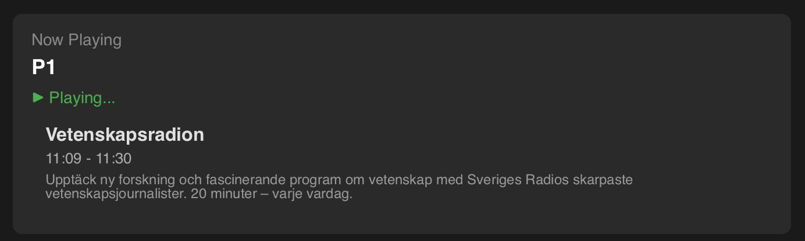

#  SR Player - Sveriges Radio Desktop Player

[](https://github.com/wlinds/SR-Player/actions)
[](https://github.com/wlinds/SR-Player/releases)
[](https://opensource.org/licenses/MPL-2.0)

A super fast and lightweight cross-platform desktop app for streaming Sveriges Radio live channels and podcasts, built with Rust, Slint, Symphonia and Rodio.




## Features

### Live Radio
- Stream all Sveriges Radio live channels
- Gapless and super fast audio playback
- Real-time "Now Playing" information
- Quick channel browsing

### Podcasts
- Browse and listen to programs and podcasts

### Cross-Platform
- Native macOS .app bundle (~5MB)
- Linux binary with minimal dependencies
- Windows executable

## Current Status: Milestone 4 Complete

The code is extensively commented and easy for new Rust developers to get into, possibly coming from Python or JavaScript.

**Working:**
- Gapless streaming using Symphonia decoder
- Fetch and display all Sveriges Radio channels from API
- Real-time "Now Playing" program information (auto-updates every 30s)
- Stockholm timezone support (handles CET/CEST automatically)
- Browse and play podcast episodes (25 most recent, server-side sorted)
- Tabbed UI for Live channels, Podcasts, and News
- Collapsible groups for P4 Local News and Ekot News
- Cross-platform builds (macOS, Linux, Windows)
- Optimized release builds (~5MB total size)
- Thread-safe async streaming architecture

## Milestone Plan

| Stage | Description |
|--------|--------------|
| M1 | Minimum UI & single stream playback
| M2 | Full channel list browsing
| M3 | Gapless streaming, macOS build
| M4 | Podcast browsing & playback, Linux & Windows build 
| M5 | Polished UI & improved packaging

## Installation

### Download Pre-built Binaries

#### macOS
1. Go to [Releases](https://github.com/wlinds/SR-Player/releases)
2. Download `SR-Player-vX.X.X-macos.zip`
3. Unzip and drag `SR Player.app` to Applications
4. Right-click and select "Open" (first time only, due to macOS Gatekeeper)

#### Linux
1. Go to [Releases](https://github.com/wlinds/SR-Player/releases)
2. Download `sr-player-vX.X.X-linux.tar.gz`
3. Extract: `tar -xzf sr-player-vX.X.X-linux.tar.gz`
4. Run: `./sr-player`

**Linux Dependencies:**
```bash
# Debian/Ubuntu
sudo apt-get install libasound2 libxcb-render0 libxcb-shape0 libxcb-xfixes0 libxkbcommon0 libfontconfig1

# Fedora/RHEL
sudo dnf install alsa-lib libxcb libxkbcommon fontconfig
```

#### Windows
1. Go to [Releases](https://github.com/wlinds/SR-Player/releases)
2. Download `sr-player-vX.X.X-windows.zip`
3. Extract the ZIP file
4. Run `sr-player.exe`

### Build from Source

**Development Mode:**
```bash
# Build and run
cargo run
```

[Syntax highlighting in VSCode for Slint](https://marketplace.visualstudio.com/items?itemName=Slint.slint)

**Production Builds:**

**macOS (App Bundle):**
```bash
# Install cargo-bundle (first time only)
cargo install cargo-bundle

# Build optimized .app bundle
cargo bundle --release

# Result: target/release/bundle/osx/SR Player.app
```

**Linux:**
```bash
# Build optimized binary
cargo build --release

# Result: target/release/sr-player
```

**Windows:**
```bash
# Build optimized binary
cargo build --release

# Result: target/release/sr-player.exe
```

## Binary Size Optimization

The release build is configured for minimal size in `Cargo.toml`:

```toml
[profile.release]
strip = true          # Strip debug symbols (~60% size reduction)
opt-level = "z"       # Optimize for size
lto = true            # Link-time optimization
codegen-units = 1     # Better optimization
panic = "abort"       # Remove unwinding machinery
```

**Size breakdown:**
- Before optimization: ~15MB (14MB binary + 1MB icon)
- After optimization: ~3-5MB total
- Comparison: Electron app (80-150MB)

## Technical Architecture

**Gapless Streaming:**
- HTTP Stream → Custom MediaSource → Symphonia Decoder → Rodio Sink
- Supports both live radio streams (AAC) and podcast episodes (MP3)
- Dedicated audio thread for thread-safe non-Send types
- Async HTTP streaming with tokio
- Eliminates gaps between audio chunks

**UI Framework:**
- Slint 1.9 for native cross-platform UI
- Declarative component-based architecture
- Compiles to native code (no web runtime)

**API Integration:**
- Sveriges Radio Open API for channels, schedules, programs, and podcasts
- Episodes endpoint (not podfiles) for reliable server-side sorting
- Async data fetching with lazy loading for performance
- Image decoding and display for program artwork
- Automatic timezone conversion (UTC → Stockholm)

---


### **License**
MPL-2.0 for open development compatibility.  
Uses Sveriges Radio API under Creative Commons Attribution stipulations.